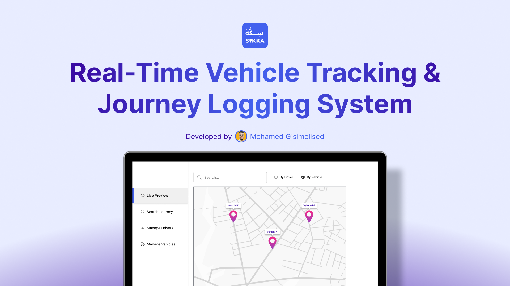

# Sikka (سكة) — Vehicle Tracking System

Sikka is a full-stack vehicle tracking platform designed to handle transit security and fleet visibility. Inspired by the real-world operational challenges of managing reliable trip histories, this system is engineered from the ground up to support robust, high-frequency telemetry data streaming and reliable route archiving.

---

## 🏗️ System Architecture Overview

The platform uses a decoupled, event-driven architecture to handle high-frequency location data efficiently:

*   **Driver's Mobile App (React Native):** Captures and sends live location coordinates. Developed for cross-platform deployment without sacrificing device performance.
*   **Message Broker (Mosquitto MQTT):** Handles receiving incoming location coordinates, ensuring the system can process lightweight, high-frequency data streams under minimal network bandwidth.
*   **Backend API (Java Spring Boot):** Handles core business logic and processes concurrent data streams efficiently using multi-threading, allowing trip history to be saved quietly in the background without slowing down the application.
*   **Database (PostgreSQL):** Stores historical route tracking data for audits, telemetry logging, and route reconstruction.
*   **Admin Dashboard (React.js):** Provides dispatchers with a live map interface for monitoring active vehicles in real time.

---

## 🛠️ Tech Stack

*   **Frontend:** React.js, React Native
*   **Backend:** Java, Spring Boot
*   **Messaging:** Mosquitto MQTT
*   **Database:** PostgreSQL

---

## 📈 Project Status

This repository is currently under active development.

*System architecture diagrams and user interface previews will be added as the components are fully integrated.*